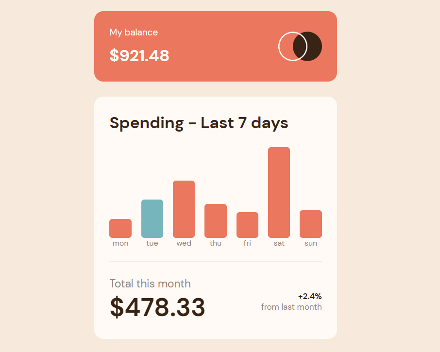

# Frontend Mentor - Expenses chart component solution

Esta é uma solução para o [desafio do componente do gráfico de despesas no Frontend Mentor](https://www.frontendmentor.io/challenges/expenses-chart-component-e7yJBUdjwt). Os desafios do Frontend Mentor ajudam você a melhorar suas habilidades de codificação criando projetos realistas.

## Índice

- [Visão Geral](#visão-geral)
  - [O Desafio](#o-desafio)
  - [Screenshot](#screenshot)
  - [Links](#links)
- [Meu Processo](#meu-processo)
  - [Feito com](#feito-com)
  - [O que eu aprendi](o-que-eu-aprendi)
  - [Continued development](#continued-development)
- [Autor](#autor)

## Visão Geral

### O Desafio

Os usuários devem ser capazes de:

- Visualizar o gráfico de barras e passar o mouse sobre as barras individuais para ver os valores corretos para cada dia ✅
- Ver a barra do dia atual destacada em uma cor diferente das outras barras ✅
- Visualizar o layout ideal para o conteúdo, dependendo do tamanho da tela do  dispositivo ✅
- Ver os estados de foco para todos os elementos interativos na página ✅
- **Bônus**: use o arquivo de dados JSON fornecido para dimensionar dinamicamente as barras no gráfico ✅

### Screenshot

### Links

- Solution URL: [GitHub](https://github.com/helioLJ/expenses-chart)
- Live Site URL: [Vercel](https://expenses-chart-ivory.vercel.app/)

## Meu Processo

### Feit com

- HTML5 Semântico
- CSS3
  - Flexbox
  - Grid
- Mobile-first workflow
- Javascript DOM Manipulation

### O que eu aprendi

Nesse projeto consegui aprender mais sobre DOM Manipulation!

### Continued development

A partir de agora eu pretendo fazer projetos mais complexos envolvendo Javascript!

## Author

- Website - [Hélio Dev.](helio-dev.vercel.app)
- Linkedin - [HelioLJ](https://www.linkedin.com/in/heliolj/)
- Frontend Mentor - [@helioLJ](https://www.frontendmentor.io/profile/helioLJ)
